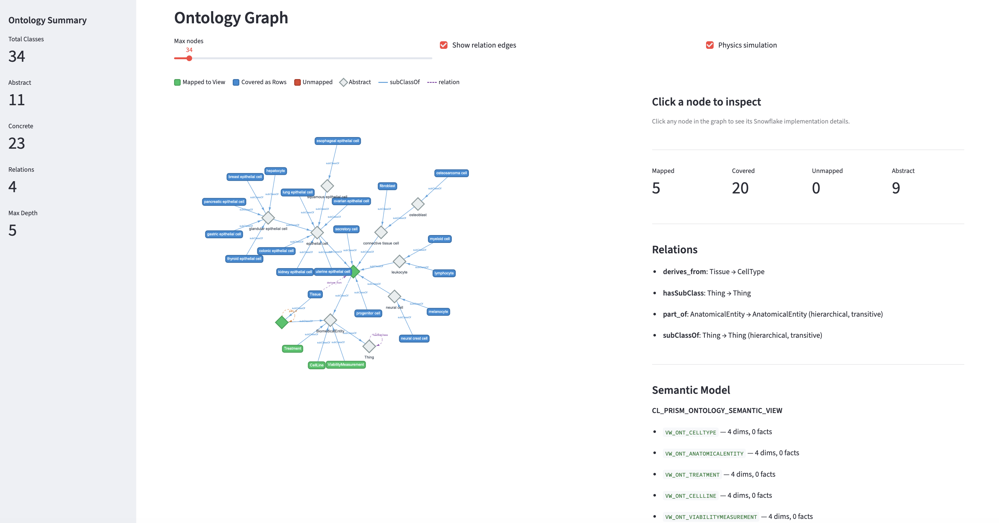

# Ontology Semantic Modeler — Cortex Code Skill

A [Cortex Code](https://docs.snowflake.com/en/user-guide/cortex-code/cortex-code) skill that generates Snowflake Cortex Analyst semantic models from OWL/RDF ontologies mapped to existing tables. Automates the bridge between domain ontologies (class hierarchies, object properties) and relational data so that Cortex Analyst can answer natural-language questions like *"What are all descendants of epithelial cell?"* using recursive CTEs it would otherwise have no knowledge of.

## Problem

Domain ontologies (OWL/RDF) encode rich class hierarchies and relationships, but querying them against relational data requires hand-written recursive CTEs, manual view layering, and deep knowledge of both the ontology and the physical schema. This skill automates that bridge.

## Repository Structure

```
coco_skill/
├── assets/
│   └── ontology_graph.png          # Ontology graph visualization screenshot
├── ontology-semantic-modeler/      # The Cortex Code skill
│   ├── SKILL.md                    # Skill definition and 6-step workflow
│   ├── scripts/                    # Python scripts (parse, generate, visualize)
│   │   ├── parse_owl.py            # OWL/RDF parser -> structured JSON
│   │   ├── generate_artifacts.py   # JSON + mappings -> SQL + YAML artifacts
│   │   └── visualize_ontology.py   # Streamlit visualization app
│   ├── assets/
│   │   └── mappings_template.json  # Blank OWL-to-table mapping template
│   └── references/
│       ├── metadata_tables_template.sql    # SQL template: 4 ontology metadata tables
│       ├── abstract_views_template.sql     # SQL template: hierarchy & entity views
│       ├── semantic_model_template.yaml    # YAML template: Cortex Analyst semantic model
│       └── example_biomed_output/
│           └── biomed_mappings.json        # Worked example (biomedical domain)
└── test/                           # End-to-end test with PRISM data
    ├── input/                      # OWL file, mappings JSON, baseline semantic model
    ├── parsed/                     # Parsed ontology JSON (34 classes, 4 relations)
    └── generated/                  # Generated SQL and semantic model YAML
```

## What It Does

Given an OWL/RDF ontology file and Snowflake tables containing domain data, the skill:

1. **Parses** the ontology into structured JSON (classes, relationships, hierarchy)
2. **Maps** OWL classes to physical Snowflake tables (with optional filter conditions for shared tables)
3. **Generates** three artifacts:
   - Metadata tables SQL (4 normalized tables capturing the ontology structure)
   - Abstract views SQL (hierarchy views, per-class entity views, unified entity view)
   - Cortex Analyst semantic model YAML (with verified queries for hierarchy traversal)
4. **Deploys** to Snowflake as a semantic view
5. **Visualizes** the ontology with an interactive Streamlit app (optional)

```
OWL file + Snowflake tables
    |
    v
parse_owl.py  -->  classes.json, relations.json
    |
    v
generate_artifacts.py  +  mappings.json
    |
    ├── 01_metadata_tables.sql
    ├── 02_abstract_views.sql
    └── 03_ontology_semantic_model.yaml
    |
    v
CREATE SEMANTIC VIEW  -->  Cortex Analyst queries
```

## Prerequisites

- **[Cortex Code](https://docs.snowflake.com/en/user-guide/cortex-code/cortex-code)** with this skill installed
- **Snowflake** account with `CREATE TABLE` and `CREATE VIEW` privileges on the target schema
- **Cortex Analyst** enabled for semantic view creation

Script-level dependencies (Python >= 3.10, [uv](https://docs.astral.sh/uv/), rdflib, pyyaml) are resolved automatically via PEP 723 inline metadata — no `pyproject.toml` or virtual environment setup needed.

## Quick Start

This is a **Cortex Code skill** — you use it through natural-language prompts, not by running scripts directly. The skill orchestrates parsing, mapping, code generation, deployment, and visualization for you.

The walkthrough below shows the exact prompts used to produce the test artifacts in [`test/`](test/). Each prompt maps to one or more steps of the skill's 6-step workflow.

### Prompt 1 — Provide inputs and parse the ontology (Steps 1-2)

> I have an OWL ontology at `test/input/cell_ontology_prism.owl` modeling the Cell Ontology hierarchy for our PRISM drug screening data. I also have a baseline semantic model at `test/input/prism_drug_efficacy.yaml`.
>
> Generate an ontology semantic model that bridges the cell type hierarchy with our Snowflake tables in `TEMP.ONTOLOGY_POC`. Use ontology name `CL_PRISM`. Source tables: `KG_NODE`, `KG_EDGE`, `PRISM_TREATMENTS`, `PRISM_CELL_LINES`, `PRISM_VIABILITY`, `PRISM_TISSUE_TO_CL`.

**What happens:** The skill collects your inputs (Step 1), runs `parse_owl.py` on the OWL file (Step 2), and reports the parsed ontology structure:

> *Parsed 34 classes (11 abstract, 23 concrete), 4 object properties, max hierarchy depth 5.*
> *Root: Thing → BiomedicalEntity → CellType / AnatomicalEntity / Treatment / CellLine / ViabilityMeasurement.*

**Output produced:** `test/parsed/classes.json`, `test/parsed/relations.json`, `test/parsed/stats.json`

---

### Prompt 2 — Confirm class-to-table mappings and generate artifacts (Steps 3-4)

> Map CellType and AnatomicalEntity to `KG_NODE` with NODE_TYPE filters. Map Treatment to `PRISM_TREATMENTS`, CellLine to `PRISM_CELL_LINES`, ViabilityMeasurement to `PRISM_VIABILITY`. For relationships, map subClassOf to `KG_EDGE` filtered by `EDGE_TYPE = 'subClassOf'`, and derives_from to `PRISM_TISSUE_TO_CL`.

**What happens:** The skill presents a mapping table for your review (Step 3), saves the confirmed mappings to `test/input/prism_biomed_mappings.json`, then runs `generate_artifacts.py` to produce all SQL and YAML (Step 4):

> *Generated 3 files:*
> - *`01_metadata_tables.sql` — 4 metadata tables (ONT_CLASS with 34 rows, ONT_RELATION_DEF with 4 rows, ONT_CLASS_MAPPING with 5 rows, ONT_RELATION_MAPPING with 2 rows)*
> - *`02_abstract_views.sql` — 10 views (VW_ONT_SUBCLASS_OF, 5 entity views, VW_ONT_ALL_ENTITIES, VW_DESCENDANTS, VW_ANCESTORS, VW_ONT_HIERARCHY_STATS)*
> - *`03_ontology_semantic_model.yaml` — 6 semantic tables, 5 verified queries*

**Output produced:** `test/generated/01_metadata_tables.sql`, `test/generated/02_abstract_views.sql`, `test/generated/03_ontology_semantic_model.yaml`

---

### Prompt 3 — Deploy to Snowflake (Step 5)

> Deploy everything to Snowflake in `TEMP.ONTOLOGY_POC`.

**What happens:** The skill executes the metadata tables SQL, then the views SQL, then creates the semantic view:

> *Created 4 metadata tables, 10 views, and semantic view `CL_PRISM_ONTOLOGY_SEMANTIC_VIEW` in `TEMP.ONTOLOGY_POC`. Verification: ONT_CLASS has 34 rows, VW_ONT_SUBCLASS_OF returns hierarchy edges, recursive descendant CTE works.*

---

### Prompt 4 — Visualize (Step 6, optional)

> Show me the ontology visualization.

**What happens:** The skill launches the Streamlit app with three tabs:

- **Class Hierarchy** — expandable tree with search, shows ancestry paths
- **Ontology Graph** — force-directed graph with coverage coloring (green = mapped, blue = covered by ancestor, red = unmapped, gray = abstract)
- **Coverage Matrix** — breakdown of mapped/covered/unmapped classes with progress bar



---

### What you can ask after deployment

Once the semantic view is live, Cortex Analyst can answer questions like:

- *"What are all descendants of epithelial cell?"* — recursive CTE traversal
- *"What are the direct children of CellType?"* — direct subclass lookup
- *"Which entities have the most direct children?"* — hub node identification
- *"Show drug efficacy for all epithelial-derived cancers"* — cohort expansion when combined with the baseline PRISM semantic model

## Running Scripts Directly

If you prefer to run the scripts outside of Cortex Code (e.g., in CI or standalone), each script uses PEP 723 inline metadata and can be run with `uv`:

```bash
# Parse OWL
uv run --script ontology-semantic-modeler/scripts/parse_owl.py -- \
  --owl-file /path/to/ontology.owl --output-dir /tmp/parsed

# Generate artifacts
uv run --script ontology-semantic-modeler/scripts/generate_artifacts.py -- \
  --classes-json /tmp/parsed/classes.json \
  --relations-json /tmp/parsed/relations.json \
  --mappings-json /path/to/mappings.json \
  --database MY_DB --schema MY_SCHEMA --ontology-name MY_ONT \
  --output-dir /tmp/generated

# Visualize
uv run --script ontology-semantic-modeler/scripts/visualize_ontology.py -- \
  --classes-json /tmp/parsed/classes.json \
  --relations-json /tmp/parsed/relations.json \
  --semantic-model /tmp/generated/03_ontology_semantic_model.yaml
```

See `parse_owl.py --help`, `generate_artifacts.py --help` for all options including `--format`, `--exclude-deprecated`, and `--namespace-filter`.

## Architecture

### 4-Table Metadata Pattern

The ontology structure is persisted in four normalized Snowflake tables:

| Table | Purpose |
|---|---|
| `ONT_CLASS` | OWL class hierarchy (name, parent, is_abstract, description) |
| `ONT_RELATION_DEF` | Object properties (domain/range, cardinality, transitivity) |
| `ONT_CLASS_MAPPING` | Maps each OWL class to a physical Snowflake table + filter |
| `ONT_RELATION_MAPPING` | Maps each OWL relationship to an edge table |

### Abstract View Layer

The semantic model references `VW_ONT_*` views rather than physical tables, providing a stable query interface:

- **`VW_ONT_SUBCLASS_OF`** — Resolved hierarchy edges with human-readable names
- **`VW_ONT_{ClassName}`** — Per-class entity views with standardized columns (`ID`, `ENTITY_TYPE`, `LABEL`, `DESCRIPTION`)
- **`VW_ONT_ALL_ENTITIES`** — `UNION ALL` across all entity views for polymorphic queries
- **`VW_DESCENDANTS` / `VW_ANCESTORS`** — Helpers for recursive CTE traversal
- **`VW_ONT_HIERARCHY_STATS`** — Direct children/parent counts per node

### Verified Query Patterns

The generated semantic model includes verified queries that Cortex Analyst can use as templates:

| Pattern | Description |
|---|---|
| `direct_children` | Simple `WHERE` on `PARENT_NAME` |
| `descendants_recursive` | Recursive CTE with configurable depth limit (default 10) |
| `most_children` | `GROUP BY` aggregation to find hub nodes |
| `entity_search` | `ILIKE` keyword search across entity labels |

### Shared Physical Tables

Multiple OWL classes can map to the same physical table differentiated by `filter_condition` (e.g., `NODE_TYPE = 'CellType'`). This is common in knowledge graph schemas where a single node table stores all entity types.

## End-to-End Test

The [`test/`](test/) directory contains a complete test using a Cell Ontology (CL) subset mapped to the [PRISM drug repurposing dataset](https://www.theprismlab.org/) on Snowflake:

- **Input:** 34-class OWL hierarchy (14 tissue-specific cell types), 5 class mappings to `TEMP.ONTOLOGY_POC` tables, baseline PRISM semantic model
- **Output:** 4 metadata tables, 10 abstract views, semantic model with 5 verified queries
- **Enables queries like:**
  - "What are all descendants of epithelial cell?" (recursive CTE)
  - "Which entities have the most direct children?" (hub node identification)
  - "Show drug efficacy for all epithelial-derived cancers" (cohort expansion via hierarchy)

See [`test/README.md`](test/README.md) for reproduction steps and detailed artifact descriptions.

## Example: Biomedical Domain

The `ontology-semantic-modeler/references/example_biomed_output/biomed_mappings.json` file shows a complete mapping for a biomedical ontology with 6 classes and 3 relationships:

**Classes:** CellType, AnatomicalEntity, GeneOntologyTerm, Treatment, CellLine, ViabilityMeasurement

**Relationships:** subClassOf, derives_from, tested_on

Key patterns demonstrated:
- Multiple OWL classes (`CellType`, `AnatomicalEntity`, `GeneOntologyTerm`) sharing one `KG_NODE` table with different `NODE_TYPE` filters
- Separate domain tables (`PRISM_TREATMENTS`, `PRISM_CELL_LINES`, `PRISM_VIABILITY`) for operational classes
- Composite ID expressions (`ROW_NAME || '::' || COLUMN_NAME`) for tables without a single primary key

## Customization

| Option | Default | Description |
|---|---|---|
| Class filtering | All non-deprecated | Filter by namespace, depth, or explicit list |
| View prefix | `VW_ONT_` | Customizable naming convention |
| Hierarchy depth limit | 10 | Max recursion depth for descendant CTEs |
| Semantic model name | `{NAME}_ONTOLOGY_SEMANTIC_VIEW` | Customizable |
| Verified queries | 5 built-in patterns | Add domain-specific query templates |

## Using as a Cortex Code Skill

Place the `ontology-semantic-modeler/` directory in your Cortex Code skills path. The skill provides a guided 6-step workflow via `SKILL.md` — gather inputs, parse OWL, map to tables, generate artifacts, deploy, visualize.

## Troubleshooting

| Issue | Resolution |
|---|---|
| OWL parse failure | Check file format — parser supports OWL/XML, Turtle, and RDF/XML. Use `--format` to override auto-detection. |
| No table matches | Provide explicit mappings. Not all OWL classes need physical tables — abstract classes are structural. |
| SQL execution errors | Check `CREATE TABLE` / `CREATE VIEW` grants on the target schema. |
| Empty views | Verify `filter_condition` values in mappings match actual data in the source tables. |

## License

Internal use.
